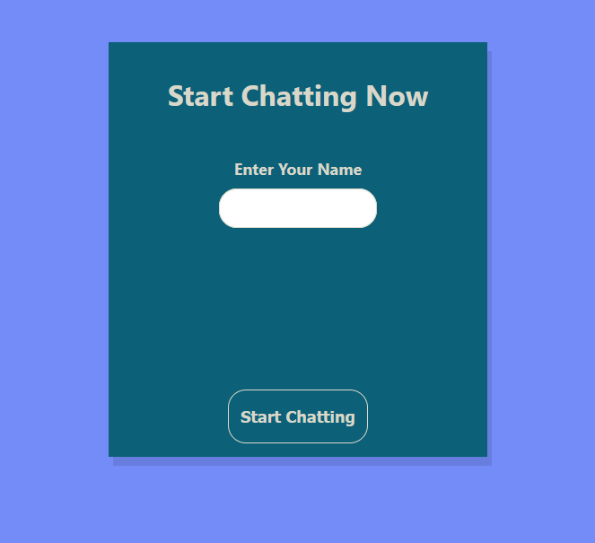
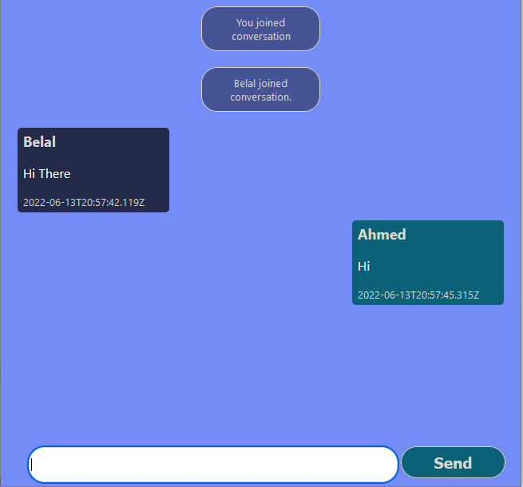
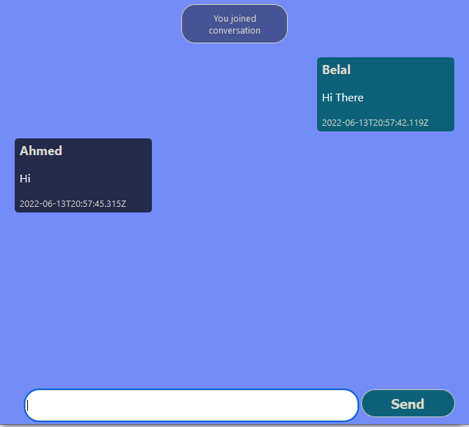

# Chat App
Simple Real Time Chat application using nodejs, express, and socket.io

**Live Demo**: https://chat-app-socket--node.herokuapp.com/

## Technologies used:
### **Front-End**:
- EJS (Template Engine)
- CSS
- Vanills JavaScript

### **Back-End**:
- socket.io (for real-time communication and sockets).
- NodeJs and Express (for creating server and handling endpoints).

#### Login Form

    

#### Chat between Two Sockets (clients). Sent and recieved messages appear differently as per client.

    
    

